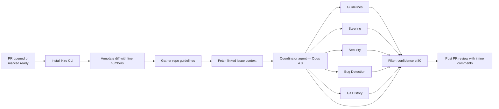

# 🔍 Kiro Code Review Action

[](https://kiro.dev/docs/cli/headless/)
[](LICENSE)

Automated PR code reviews powered by [Kiro CLI](https://kiro.dev/cli/) in headless mode. A coordinator agent spawns specialized review agents in parallel, filters findings by confidence score, and posts inline review comments directly on the PR.

---

## How It Works



1. A pull request is opened (or a draft PR is marked ready)
2. Kiro CLI is installed and the PR diff is annotated with absolute line numbers
3. Repo guidelines (AGENTS.md, CLAUDE.md) and Kiro steering rules (`.kiro/steering/`) are gathered separately
4. Linked issue context is fetched from the PR body (parses `Closes #N`, `Fixes #N`, etc.)
5. The coordinator agent (Opus 4.8) spawns **5 subagents in parallel** (Sonnet 5):
   - **Guidelines** — compliance against AGENTS.md / CLAUDE.md
   - **Steering** — adherence to `.kiro/steering/*.md`, honoring `inclusion: always | fileMatch | manual`
   - **Security** — injection, authz/authn gaps, secret handling, SSRF, unsafe shell, input validation
   - **Bug Detection** — scans for bugs, error handling issues, and test coverage gaps
   - **Git History** — analyzes blame/log for context (fragile code, reverted fixes, churn)
6. The coordinator performs its own **design review** — evaluating completeness, abstraction layer, and approach
7. All findings are filtered by confidence (threshold: 80), deduplicated, and assigned severity
8. Results are posted as a PR review with inline comments on specific diff lines

---

## Features

| | |
|---|---|
| **5-agent architecture** | Guidelines compliance, Kiro steering adherence, security review, bug detection, git history analysis — all in parallel |
| **Confidence scoring** | Each finding scored 0-100; only ≥80 confidence findings are posted |
| **Design review** | Coordinator evaluates issue completeness, abstraction layer, sibling components |
| **Repo guidelines** | Checks changes against AGENTS.md and CLAUDE.md |
| **Kiro steering** | Dedicated agent audits `.kiro/steering/*.md`, honoring `inclusion` front-matter (always / fileMatch / manual) |
| **Security review** | Dedicated agent for injection, authz/authn, secrets, SSRF, unsafe shell, and input validation |
| **Git history context** | Uses blame/log to identify fragile code, reverted fixes, and churn patterns |
| **Severity tags** | Findings tagged `[high]`, `[medium]`, `[low]` for clear prioritization |
| **Inline comments** | Findings posted on exact diff lines with confidence scores |
| **Issue-aware** | Fetches linked issue context to evaluate whether the PR solves the stated problem |
| **Verdict** | Clear merge recommendation: merge, merge with fixes, or needs rework |
| **Merge gate** | Optional — a `needs rework` verdict can fail the check to block merge (`KIRO_REVIEW_BLOCK`), with a `skip-kiro-review` label bypass |
| **One-time review** | Runs on PR open or draft ready; re-run manually via workflow_dispatch |

---

## Quick Setup

### 1. Copy the files into your repo

```
your-repo/
├── .github/
│   ├── scripts/
│   │   ├── annotate-diff.sh          # Adds line numbers to diff
│   │   └── post-review.sh            # Posts review via GitHub API
│   └── workflows/
│       └── kiro-code-review.yml
└── .kiro/
    └── agents/
        ├── code-reviewer.json          # Coordinator (Opus 4.8)
        ├── code-bugs.json              # Bug detection (Sonnet 5)
        ├── code-guidelines.json        # AGENTS.md/CLAUDE.md compliance (Sonnet 5)
        ├── code-steering.json          # Kiro steering adherence (Sonnet 5)
        ├── code-security.json          # Security review (Sonnet 5)
        ├── code-history.json           # Git history analysis (Sonnet 5)
        └── prompts/
            ├── code-reviewer.md
            ├── code-bugs.md
            ├── code-guidelines.md
            ├── code-steering.md
            ├── code-security.md
            └── code-history.md
```

### 2. Add your Kiro API key

Go to **Settings → Secrets and variables → Actions** in your GitHub repo and add:

| Secret | Value |
|--------|-------|
| `KIRO_API_KEY` | Your Kiro API key ([generate one here](https://kiro.dev/docs/cli/authentication#authenticate-with-an-api-key-headless-mode)) |

> [!NOTE]
> API keys require a **Kiro Pro, Pro+, or Power** subscription.

### 3. Open a pull request

That's it. The workflow triggers automatically on new PRs and posts a review.

---

## Example Output

The action posts a PR review with inline comments:

**Review body** (summary + strengths + verdict):
> 🤖 **Kiro Code Review**
>
> This PR adds user authentication. The implementation is solid with good test coverage, but there's a null pointer issue and a missing input validation check.
>
> ### Strengths
> - Clean separation of auth logic into dedicated handler (src/auth/handler.ts)
> - Comprehensive test coverage for the happy path
>
> **Verdict: Merge with fixes** — Fix the null check and input validation before merge.
>
> ---
> *Found 2 finding(s). Powered by [Kiro CLI](https://kiro.dev/docs/cli/headless/).* · To re-run, go to Actions → Kiro Code Review → Run workflow.

**Inline comments** (on specific diff lines):
> **[high]** `user.email` can be `null` when the OAuth provider doesn't return an email. Calling `.toLowerCase()` will throw a TypeError at runtime. _(confidence: 92)_

> **[medium]** [design] The linked issue asks for auth across all routes, but this PR only adds it to `/api/users`. The `/api/admin` routes are unprotected. _(confidence: 88)_

---

## Customization

### Changing what the agents review

Each agent has its own prompt file:

- `.kiro/agents/prompts/code-bugs.md` — bug detection rules and focus areas
- `.kiro/agents/prompts/code-guidelines.md` — AGENTS.md/CLAUDE.md compliance rules
- `.kiro/agents/prompts/code-steering.md` — Kiro steering adherence + inclusion semantics
- `.kiro/agents/prompts/code-security.md` — security review focus areas
- `.kiro/agents/prompts/code-history.md` — git history analysis rules
- `.kiro/agents/prompts/code-reviewer.md` — coordinator prompt (spawning, filtering, design review)

### Adjusting the confidence threshold

The default threshold is 80. To change it, edit `code-reviewer.md`:

```
6. **Filter by confidence**: Drop any finding with confidence below 80.
```

### Changing the models

Edit the `model` field in any agent's `.json` config:

```json
{
  "model": "claude-sonnet-5"
}
```

The coordinator uses `claude-opus-4.8` by default; subagents use `claude-sonnet-5`.

### When the review runs

By default, the review runs **once when a PR is opened**. Subsequent pushes don't trigger a re-review — you re-run manually when you're ready.

To change this behavior, edit the `types` array in `.github/workflows/kiro-code-review.yml`:

```yaml
# Default: review on open or when draft is marked ready (manual re-run for subsequent pushes)
on:
  pull_request:
    types: [opened, ready_for_review]

# Review on every push (more thorough, higher cost)
on:
  pull_request:
    types: [opened, ready_for_review, synchronize]
```

| Mode | Trigger | Cost | Best for |
|------|---------|------|----------|
| `[opened, ready_for_review]` (default) | First commit / draft ready | Low — one review per PR | Teams that iterate quickly and re-run manually |
| `+ synchronize` | Every push | Higher — review per push | Teams that want continuous automated feedback |

Both modes support manual re-runs via workflow_dispatch.

### Re-running a review

To manually re-run a review on any PR:

1. Go to **Actions** → **Kiro Code Review** → **Run workflow**
2. Enter the PR number and click **Run workflow**

Or from the CLI:
```bash
gh workflow run kiro-code-review.yml -f pr_number=<PR_NUMBER>
```

### Merge gate: block or advisory

The review is **advisory by default** — it posts findings and a verdict but never fails the check. Flip it into a blocking gate with the `KIRO_REVIEW_BLOCK` flag:

| `KIRO_REVIEW_BLOCK` | Behavior |
|---|---|
| `false` (default) | Advisory. Post findings and verdict; the check always passes. |
| `true` | Blocking. A `needs rework` verdict fails the job. |

Enable it by adding a repo/org **Actions variable** (Settings → Secrets and variables → Actions → Variables) named `KIRO_REVIEW_BLOCK` set to `true`. To make a failed review actually stop the merge, also mark the **Kiro Code Review** check as required under **Settings → Branches → Branch protection rules** — otherwise the red check is visible but the merge button stays active.

The gate fires on the coordinator's `needs rework` verdict, which its rubric reserves for "high issues, wrong approach, or fundamentally incomplete." `merge` and `merge with fixes` never block.

**Per-PR override.** Add the `skip-kiro-review` label to a pull request to bypass the gate for that PR — the review still runs and posts findings, but a `needs rework` verdict won't fail the check. Useful for urgent hotfixes or overriding a false block.

**Fail-closed on missing output.** If the review produces no output at all (coordinator crash, model error), the check posts "review did not complete" instead of claiming the code is clean. In blocking mode this fails the check; the `skip-kiro-review` label overrides it.

> [!NOTE]
> LLM verdicts are non-deterministic — the same PR can flip between `merge with fixes` and `needs rework` across runs. Consider running advisory for a week before enabling blocking, and rely on the label override as an escape hatch.

### Adding an MCP server for semantic code search

[Augment](https://www.augmentcode.com/) semantic code search is pre-configured but disabled by default. To enable it:

1. Add `AUGMENT_API_KEY` to your repo secrets (Settings → Secrets → Actions).
2. Add `AUGMENT_API_KEY: ${{ secrets.AUGMENT_API_KEY }}` to the workflow env block.
3. Set `"disabled": false` in the `auggie` MCP config in the agent JSON files.

---

## Architecture

```
┌──────────────────────────────────────────────────────┐
│  GitHub Actions Workflow                              │
│                                                       │
│  1. Install CLI → 2. Annotate diff → 3. Guidelines   │
│  4. Fetch linked issue context                        │
│                                                       │
│  5. kiro-cli (coordinator — Opus 4.8)                 │
│     ├── spawns code-guidelines  (Sonnet 5)         │
│     ├── spawns code-steering    (Sonnet 5)         │
│     ├── spawns code-security   (Sonnet 5)         │
│     ├── spawns code-bugs        (Sonnet 5)         │
│     ├── spawns code-history     (Sonnet 5)         │
│     ├── filters by confidence (≥ 80)                  │
│     ├── performs design review                        │
│     └── merges → /tmp/kiro-review.json                │
│                                                       │
│  6. post-review.sh → GitHub reviews API               │
└──────────────────────────────────────────────────────┘
```

The coordinator reads issue context and repo guidelines, then delegates analysis to 5 specialized subagents running in parallel. Each subagent scores findings by confidence (0-100). The coordinator filters out anything below 80, boosts confidence when the guidelines and steering agents agree, performs its own design review, and writes a merged result. The posting script submits it as a PR review with inline comments.

---

## Project Structure

```
.github/
├── scripts/
│   ├── annotate-diff.sh             # Adds [N] line annotations to diff
│   └── post-review.sh              # Posts review via GitHub reviews API
└── workflows/
    └── kiro-code-review.yml        # GitHub Actions workflow

.kiro/
└── agents/
    ├── code-reviewer.json           # Coordinator (Opus 4.8)
    ├── code-bugs.json               # Bug detection (Sonnet 5)
    ├── code-guidelines.json         # AGENTS.md/CLAUDE.md compliance (Sonnet 5)
    ├── code-steering.json           # Kiro steering adherence (Sonnet 5)
    ├── code-security.json           # Security review (Sonnet 5)
    ├── code-history.json            # Git history analysis (Sonnet 5)
    └── prompts/
        ├── code-reviewer.md         # Coordinator prompt
        ├── code-bugs.md             # Bug detection prompt
        ├── code-guidelines.md       # Guidelines compliance prompt
        ├── code-steering.md         # Kiro steering adherence prompt
        ├── code-security.md         # Security review prompt
        └── code-history.md          # Git history prompt
```

---

## Troubleshooting

| Problem | Solution |
|---------|----------|
| Workflow doesn't trigger | Ensure the workflow file is on the default branch |
| "API key" errors | Verify `KIRO_API_KEY` is set in repo secrets |
| No review posted | Check the workflow logs — the agent may not have found issues above the confidence threshold |
| No issue context | Ensure the PR body contains `Closes #N`, `Fixes #N`, or `Resolves #N` linking to an issue |
| No guidelines findings | Add an AGENTS.md or CLAUDE.md to your repo |
| No steering findings | Add `.kiro/steering/*.md` files; confirm their `inclusion` front-matter matches the changed files |
| Want to re-run | Go to Actions → Kiro Code Review → Run workflow → enter PR number |

---

## Requirements

- [Kiro CLI](https://kiro.dev/cli/) (installed automatically by the workflow)
- Kiro Pro, Pro+, or Power subscription (for API key access)
- GitHub repository with Actions enabled

---

## License

[MIT](LICENSE)
