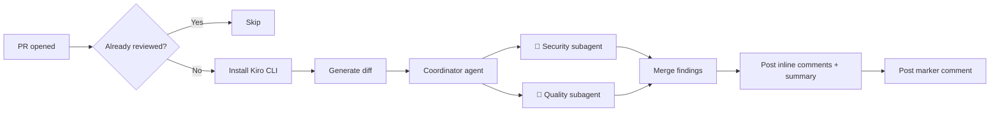

# 🔍 Kiro Code Review Action

[](https://kiro.dev/docs/cli/headless/)
[](LICENSE)

Automated PR code reviews powered by [Kiro CLI](https://kiro.dev/cli/) in headless mode. A custom AI agent analyzes your pull request diff for security vulnerabilities and code quality issues, then posts inline review comments directly on the PR.

---

## How It Works



1. A pull request is opened or updated
2. The workflow checks for a marker comment — if found, the review is skipped
3. Kiro CLI is installed and the PR diff is generated via `gh pr diff`
4. The `code-reviewer` coordinator agent spawns two subagents **in parallel**:
   - `code-security` — focused on security vulnerabilities
   - `code-quality` — focused on bugs, error handling, and code quality
5. The coordinator merges findings from both subagents and deduplicates
6. Findings are posted as a single PR review with inline comments on specific lines
7. A hidden marker comment is posted to prevent duplicate reviews

---

## Features

| | |
|---|---|
| 🔴 **Security review** | Injection flaws, hardcoded secrets, insecure defaults, missing validation |
| 🟡 **Bug detection** | Null access, off-by-one errors, race conditions, resource leaks |
| 🟠 **Error handling** | Swallowed exceptions, missing error checks |
| 🔵 **Code quality** | Unnecessary complexity, dead code, poor naming |
| 🧩 **Parallel subagents** | Security and quality reviews run simultaneously via Kiro subagents |
| 💬 **Inline comments** | Findings posted on the exact lines in the PR diff |
| 📝 **Summary** | Overall review summary posted as the review body |
| 🔒 **One-time review** | Runs once per PR — subsequent pushes don't re-trigger |

---

## Quick Setup

### 1. Copy the files into your repo

```
your-repo/
├── .github/
│   ├── scripts/
│   │   └── post-review.sh
│   └── workflows/
│       └── kiro-code-review.yml
└── .kiro/
    └── agents/
        ├── code-reviewer.json          # Coordinator
        ├── code-security.json          # Security subagent
        ├── code-quality.json           # Quality subagent
        └── prompts/
            ├── code-reviewer.md
            ├── code-security.md
            └── code-quality.md
```

### 2. Add your Kiro API key

Go to **Settings → Secrets and variables → Actions** in your GitHub repo and add:

| Secret | Value |
|--------|-------|
| `KIRO_API_KEY` | Your Kiro API key ([generate one here](https://kiro.dev/docs/cli/authentication#authenticate-with-an-api-key-headless-mode)) |

> [!NOTE]
> API keys require a **Kiro Pro, Pro+, or Power** subscription.

### 3. Open a pull request

That's it. The workflow triggers automatically on new PRs and posts a review.

---

## Example Output

The action posts a PR review that looks like this:

**Review summary** (on the review body):
> 🤖 **Kiro Code Review**
>
> This PR introduces a new authentication endpoint. The implementation is mostly solid, but there are two security concerns around input validation and one potential null pointer issue.
>
> ---
> *Found 3 finding(s). Powered by [Kiro CLI](https://kiro.dev/docs/cli/headless/).*

**Inline comments** (on specific lines):
> 🔴 User input is passed directly to the SQL query without parameterization. Use prepared statements to prevent SQL injection.

> 🟡 `user.email` can be `null` when the OAuth provider doesn't return an email. Add a null check before accessing `.toLowerCase()`.

---

## Customization

### Changing what the agents review

Each subagent has its own prompt file:

- `.kiro/agents/prompts/code-security.md` — security focus areas and rules
- `.kiro/agents/prompts/code-quality.md` — bugs, error handling, and quality rules

Edit these to adjust review categories, severity levels, exclusions, or tone.

### Adding a new subagent

1. Create a new agent config (e.g., `.kiro/agents/code-performance.json`)
2. Create its prompt (e.g., `.kiro/agents/prompts/code-performance.md`)
3. Update the coordinator prompt in `code-reviewer.md` to spawn the new subagent

### Changing the model

Edit the `model` field in any agent's `.json` config:

```json
{
  "model": "claude-sonnet-4"
}
```

### Changing when it runs

Edit `.github/workflows/kiro-code-review.yml`:

```yaml
on:
  pull_request:
    types: [opened, synchronize]
    paths-ignore:
      - '**.md'
      - 'docs/**'
```

### Re-running a review

Delete the `<!-- kiro-review-complete -->` marker comment from the PR, then push a new commit or re-run the workflow.

---

## Architecture

```
┌─────────────────────────────────────────────┐
│  GitHub Actions Workflow                     │
│                                              │
│  1. Check marker → 2. Install CLI → 3. Diff │
│                                              │
│  4. kiro-cli (coordinator agent)             │
│     ├── spawns code-security (parallel)      │
│     ├── spawns code-quality  (parallel)      │
│     └── merges → /tmp/kiro-review.json       │
│                                              │
│  5. post-review.sh → gh api (PR review)      │
│  6. Post marker comment                      │
└─────────────────────────────────────────────┘
```

The coordinator agent delegates analysis to specialized subagents that run in parallel with their own context. Each subagent writes findings to a separate JSON file. The coordinator reads both, deduplicates, and writes a merged result that the posting script submits as a single PR review.

---

## Project Structure

```
.github/
├── scripts/
│   └── post-review.sh              # Reads findings JSON, posts PR review via gh api
└── workflows/
    └── kiro-code-review.yml        # GitHub Actions workflow

.kiro/
└── agents/
    ├── code-reviewer.json           # Coordinator agent config
    ├── code-security.json           # Security subagent config
    ├── code-quality.json            # Quality subagent config
    └── prompts/
        ├── code-reviewer.md         # Coordinator prompt (spawn + merge)
        ├── code-security.md         # Security review prompt
        └── code-quality.md          # Quality review prompt
```

---

## Troubleshooting

| Problem | Solution |
|---------|----------|
| Workflow doesn't trigger | Ensure the workflow file is on the default branch |
| "API key" errors | Verify `KIRO_API_KEY` is set in repo secrets |
| No review posted | Check the workflow logs — the agent may not have found issues |
| Review posted twice | The marker comment check may have failed — look for `<!-- kiro-review-complete -->` in PR comments |
| Inline comments on wrong lines | The agent parses line numbers from diff hunk headers — complex rebases can cause drift |

---

## Requirements

- [Kiro CLI](https://kiro.dev/cli/) (installed automatically by the workflow)
- Kiro Pro, Pro+, or Power subscription (for API key access)
- GitHub repository with Actions enabled

---

## License

[MIT](LICENSE)
